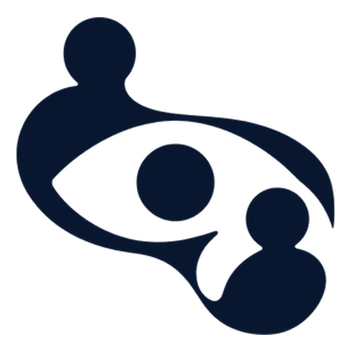

<div align="center">



# Elseview

**See what you're missing.**

*User research and AI-powered testing — for people who would rather find out than assume.*

[Explore the preview](frontend/) · [Frontend docs](frontend/README.md) · [Product plan](docs/PRODUCT_PLAN.md)

</div>

---

## The idea

Most product decisions are made on a hunch. A launch goes out, and six weeks later someone asks *why did conversion drop* — and the honest answer is nobody checked.

Elseview exists to close that gap between what you believe and what you know.

The name is the idea. An eye drawn from two people in conversation: **else**view — a second pair of eyes on the work you are too close to see clearly.

## What we believe

Elseview is not built on the premise that AI replaces research. It is built on the opposite one: **AI produces signals, people produce evidence.**

Every claim in the product is paired with its limit:

> Simulated findings can suggest what to investigate; they are not evidence of what real users think.
> — *research principle 02*

> Good insights invite scrutiny. Find the proof, not just the pattern.
> — *research principle 03*

The methodology runs through four stages — **Understand → Test → Interpret → Continue** — and the discipline is in what each stage refuses to claim. Start with a question, not a conclusion. AI-generated signals need human validation. Let real people shape what comes next.

That stance is the product. Everything else is tooling in service of it.

## Who's it for

Two sides, one loop.

| | **Researchers** | **Testers** |
| --- | --- | --- |
| **Want** | Publish tests, get real evidence | Take tests, get paid |
| **Do** | Design studies, recruit, collect, analyse, report | Apply, qualify, take sessions, track earnings |
| **Live at** | `/dashboard` | `/tester` |

Also built for designers, product managers and founders — anyone who has to defend a roadmap decision with evidence rather than conviction.

## The methods

Fifteen research instruments, from a single question to a full programme:

**Perception** — first-click, five-second, preference
**Comprehension** — menu test, survey (single, multiple, rating, free text)
**Structure** — card sorting, ranking, constant-sum
**Behaviour** — prototype tasks, accessibility issues
**Product** — wording review, recruiting

Plus AI-assisted analysis to help prioritise what to investigate next.

## Status — read this before evaluating the product

**Elseview is currently an interactive product preview, not a live research service.** The site says so in four languages and does not hedge it. Specifically:

- The **landing page, authentication flow and legal pages are complete and interactive**.
- **Workspace and tester screens render demonstration data.** They do not run live studies, recruit participants, or collect responses.
- The **authentication flow is a simulation**. It does not establish identity, verify codes, or send email.
- **All findings, scenarios and use-case examples shown are illustrative** — not customer testimonials, not measured outcomes.
- The **tester pages are fixture data** and are not yet connected to a backend.

Do not enter personal participant data, confidential research, credentials, or health information into this preview. Use fictional information only.

<details>
<summary><b>On the logos in the header carousel</b></summary>

The landing page displays a "Trusted by leading brands" logo carousel. Treat that as **unverified marketing artwork carried over from the design template**, not as a list of customers, partners, or integrations — the preview has no paying customers and no backend. If you own the rights to those marks and do not have a relationship with these organisations, remove the carousel from `frontend/src/components/LogoCarousel.tsx` and its assertions in `landing-copy.test.tsx` before launch.

</details>

## Design

Built around one idea: **research should feel calm, not clinical.**

| | |
| --- | --- |
| **Wordmark** | An eye formed by two figures in conversation |
| **Ink** | `#07172f` — deep navy |
| **Signal** | `#30d158` — green status dot |
| **Type** | Large, tight-tracked headings (`tracking-[-0.05em]`) over quiet body copy |
| **Motion** | GSAP and ScrollTrigger, with full `prefers-reduced-motion` support |

Handwriting accents, counter-scrolling logo rows, sticky scroll panels — the landing page reads like a product essay, not a feature grid.

**Bilingual by construction.** Every string is authored as `{ en, fr }` and resolved through `useAuthLocale()`, so French is a peer of English rather than a translation afterthought. The language toggle sits in the landing header.

**Accessibility is part of the aesthetic, not a retrofit.** Semantic landmarks, visible focus rings, keyboard-navigable dialogs, decorative imagery marked `alt=""`, and motion that respects `prefers-reduced-motion`.

## Architecture

```
frontend/          React 19 · TypeScript · Vite 8 · Tailwind · shadcn/ui
src/lib/routes.ts  Single source of truth for every URL
src/pages/         auth · legal · workspace · tester
src/components/    workspace (researcher) · tester · ui primitives
```

**One route table.** No component writes a path literal. Everything imports from `src/lib/routes.ts` and uses `withQuery` / `authRoute` to attach parameters. `src/lib/auth.test.ts` walks the whole source tree and fails the build if any `href`, `to`, or `navigate()` target lacks a real destination — so a link can't silently rot into a 404.

**Two spaces, strictly separated.** A tester can never reach a researcher page that manages studies, credits, reports or billing. That's enforced by a route-boundary test, not just convention.

**English and French throughout**, with RTL-ready form inputs.

## Run it

```sh
cd frontend
pnpm install --frozen-lockfile
pnpm dev --host 127.0.0.1 --port 8080 --strictPort
```

Node 24 and pnpm. The landing page and auth flow need no backend. Workspace screens call `/api/v1` on their own origin, so they render an empty state unless a backend is reachable — set `API_PROXY_TARGET` (defaults to `http://localhost:8000`) to point the Vite proxy at one.

```sh
pnpm exec tsc -p tsconfig.app.json --noEmit   # types
pnpm lint                                     # lint
pnpm test                                     # 102 tests
pnpm build                                    # production bundle
```

## Documentation

| | |
| --- | --- |
| [Frontend README](frontend/README.md) | Routes, architecture, development |
| [Product plan](docs/PRODUCT_PLAN.md) | Both journeys, backend gaps, ordered build plan |
| [Frontend audit](docs/FRONTEND_AUDIT.md) | Per-page status: done, mock, wired, missing |
| [Acceptance guide](frontend/docs/local-testing.md) | Browser checks and fixtures |

## Licence

© 2026 Elseview. All rights reserved.

[`Terms`](frontend/src/pages/legal/LegalNotice.tsx) and [`Privacy`](frontend/src/pages/legal/LegalNotice.tsx) are placeholders — the policies are not yet published.