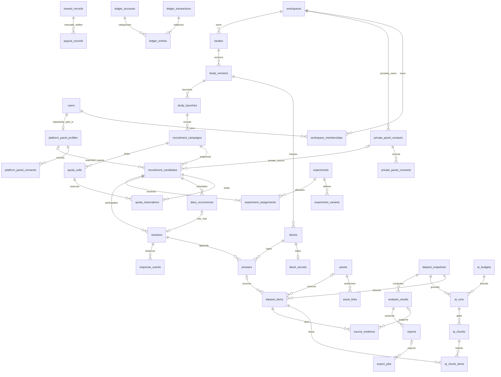

# Elseview — Extended PostgreSQL Data Model — Future Reference

**Brand:** Elseview — See what you’re missing.

**Architecture revision:** this is the larger normalized reference, not the lightweight launch schema. `/Users/user/Workspace/startup-act/BACKEND_BLUEPRINT.md` takes precedence: four containers, embedded backend jobs and an OpenAI-compatible cloud LLM. Create only tables required by shipped features.

## 1. Scope and reading rules

This is a **planned relational dictionary, not executable DDL or an implemented system**. It covers 70 application tables in the agreed 17 modules. Context: [blueprint](/Users/user/Workspace/startup-act/BACKEND_BLUEPRINT.md), [research platform](/Users/user/Workspace/startup-act/RESEARCH_PLATFORM.md), and [startup ideas](/Users/user/Workspace/startup-act/STARTUP_IDEAS.md); unrelated marketplace ideas are outside this model.
The chosen backend is a modular monolith: FastAPI, Python 3.12, SQLAlchemy 2, Alembic, PostgreSQL 16, and **synchronous psycopg sessions with explicit service-owned transactions**. The backend contains a small PostgreSQL-backed job loop; Valkey is cache only, not a broker. Private filesystem storage is the default; an object-store adapter is optional.
All features below are planned. A configured cloud LLM processes only explicitly permitted data. No automatic participant payout, escrow, or cross-client private-panel sharing is implied. Deterministic analysis computes metrics; AI may explain them, not invent them.

- A field is written `name type!` for NOT NULL or `name type?` for nullable. Every table expands the named base column sets below; no other columns are implicit.
- **G** = `id uuid!` primary key, `created_at timestamptz!`. **T** = G plus `workspace_id uuid! →workspaces`, and unique `(workspace_id,id)`. **M** = `updated_at timestamptz!`. **D** = `deleted_at timestamptz?`. The workspace root uses G, not T.
- `→table` means an actual FK to `id`; between two T tables it always means `(workspace_id,field) → (workspace_id,id)`. Global references are explicitly marked `global`. All FKs default to ON DELETE RESTRICT / ON UPDATE RESTRICT; purge exceptions are listed in §8.
- `U(a,b)` means UNIQUE `(workspace_id,a,b)` on T tables and UNIQUE `(a,b)` on G tables. `GU(...)` is explicitly global uniqueness. Parent keys required by larger composite FKs are specified in §4.
- Braces after a text column give its complete CHECK value set. Named JSON contracts are defined in §5. UUIDs are generated by the service; time defaults to transaction time, counts to zero only where stated, and nullable fields to NULL. Other required fields have no implied default.
- `*_hash bytea` and `*_digest bytea` are 32-byte digests with length checks. Secrets use random high-entropy tokens; email/contact lookup uses keyed HMAC, not an unsalted email hash. Ciphertext includes an envelope key version; encryption keys stay outside this database.
- Money is signed or nonnegative `bigint` **TND millimes** as stated: 1 TND = 1,000 millimes. Credits are separate integer units. No float is allowed for money, credit balances, prices, budgets, or token counts. Decimal rates in JSON are strings, not binary floats.
- Keys are bounded, nonempty text (maximum 128 bytes); timestamps use UTC instants. Time-zone fields hold validated IANA names. JSON documents have explicit schema versions, byte limits, and allowlisted properties; they are not hidden relational join tables.
- Ordinary row CHECKs, PKs, U constraints, and FKs are database rules. Cross-row/frozen-state rules need the specified service transaction and planned database trigger or restricted posting routine; a CHECK alone cannot enforce them [1].

## 2. Tenant, identity, and actor boundaries

`users` is global login identity, not a participant directory. `platform_panel_profiles` exists only after a separate platform-panel opt-in. Platform qualifications contain only platform-owned assessments. Workspace membership does not grant access to the global panel tables.
`private_panel_contacts` and their consents belong to exactly one workspace. They have **no user/profile FK**, no global contact dedupe, and no automatic platform enrollment. Even matching email addresses in two clients' lists never merge their records. Any later platform opt-in is a separate participant action with a separate record and purpose.
Recruitment copies a minimal, approved attribute snapshot into `recruitment_candidates`. Its optional source pointer is restricted recruitment metadata, not a live profile join available to researchers or participant routes. Consent changes do not rewrite history, but do stop future contact and can require erasure of the snapshot. Private-panel answers, quality flags, and outcomes never update a global panel profile.
Every workspace service query includes `workspace_id`; all writes verify membership/role, resource scope, and current consent. Researchers see pseudonyms by default; contact access is a separate privilege. Reviewers receive assigned research data, viewers approved results, and participants only their own permitted collection state. Staff access requires a reason and audit event.
Anonymous actors use an unguessable invite capability, stored only as a hash, exchanged for a short-lived scoped session capability. Token lookup resolves workspace/candidate/version internally; callers do not select those IDs. Public raw UUIDs are never credentials. Raw tokens, private contact values, answers, and provider secrets must not enter URLs in logs, outbox payloads, or audit metadata.
Optional RLS is defense in depth: a non-owner, non-superuser, non-BYPASSRLS application role uses `USING` and `WITH CHECK` tenant policies, with missing context denied; consider FORCE ROW LEVEL SECURITY for owners [2]. A narrow token-lookup role/function resolves capabilities without broad anonymous table access.
For **each** API/worker transaction, authenticate first, begin, then set transaction-local tenant/actor context with `SET LOCAL` or bound `set_config(..., true)` before scoped SQL. Never use session-level SET. Commit/rollback and close before pool return; reset the pool connection and reject stale/missing context. Set context again after rollback to an earlier savepoint [3]. RLS does not replace authorization, composite FKs, safe serializers, or storage checks, and a role able to change context is not isolated by that context alone.

## 3. Tables by owning module

### identity — 4 tables

#### 01. `users` — G+M+D; global authentication subject
- Columns: `email_cipher bytea?`, `email_lookup_hash bytea?`, `display_name_cipher bytea?`, `status text! {active,disabled,anonymized}`, `locale text!`, `anonymized_at timestamptz?`.
- Keys/rules: U(email_lookup_hash) when present; email fields are both present or both NULL. Anonymization removes identity values and credentials; retained UUIDs are not a reusable panel identity.

#### 02. `auth_credentials` — G+M; global secret authentication data
- Columns: `user_id uuid! →users global`, `kind text! {password,totp}`, `password_hash text?`, `secret_cipher bytea?`, `verified_at timestamptz?`, `revoked_at timestamptz?`.
- Keys/rules: U(user_id,kind); password kind requires only password_hash; totp requires only secret_cipher. Credentials are never copied into workspace tables.

#### 03. `refresh_tokens` — G; global rotating login grants
- Columns: `user_id uuid! →users global`, `family_id uuid!`, `token_hash bytea!`, `replaces_token_id uuid? →refresh_tokens global`, `expires_at timestamptz!`, `used_at timestamptz?`, `revoked_at timestamptz?`.
- Keys/rules: U(token_hash), U(replaces_token_id) when present; replacement must have the same user/family, enforced by a composite FK. Rotation locks the predecessor; reuse revokes the family. family_id groups grants, not an external entity.

#### 04. `api_keys` — T+M; machine actors
- Columns: `owner_membership_id uuid! →workspace_memberships`, `label text!`, `token_hash bytea!`, `scopes text[]!`, `expires_at timestamptz?`, `last_used_at timestamptz?`, `revoked_at timestamptz?`.
- Keys/rules: GU(token_hash); nonempty allowlisted scopes cannot exceed the owner's current role. Revoked membership disables its keys; keys cannot select another tenant.

### workspaces — 3 tables

#### 05. `workspaces` — G+M+D; tenant root
- Columns: `slug text!`, `name text!`, `status text! {active,suspended,purging,closed}`, `default_locale text!`, `timezone text!`, `retention_days integer!`, `privacy_epoch bigint!`.
- Keys/rules: U(slug); retention_days > 0; privacy_epoch >= 0, initially 0. Closure blocks new work; financial retention may keep a name-free tenant tombstone.

#### 06. `workspace_memberships` — T+M; team authorization
- Columns: `user_id uuid! →users global`, `role text! {owner,admin,researcher,reviewer,viewer}`, `status text! {invited,active,revoked}`, `joined_at timestamptz?`, `revoked_at timestamptz?`.
- Keys/rules: U(user_id); role changes lock the workspace and cannot remove its final active owner. Membership IDs, rather than bare global user IDs, attribute workspace actions.

#### 07. `workspace_invites` — T+M; staff invitations
- Columns: `email_cipher bytea!`, `email_lookup_hash bytea!`, `role text! {admin,researcher,reviewer,viewer}`, `token_hash bytea!`, `invited_by_membership_id uuid! →workspace_memberships`, `expires_at timestamptz!`, `accepted_at timestamptz?`, `revoked_at timestamptz?`.
- Keys/rules: GU(token_hash); U(email_lookup_hash) WHERE accepted_at IS NULL AND revoked_at IS NULL. Explicitly revoke/expire a prior invite before replacing it; no time-dependent index predicate.

### panel — 5 tables

#### 08. `platform_panel_profiles` — G+M+D; opt-in platform-owned panel
- Columns: `user_id uuid! →users global`, `panel_code text!`, `status text! {active,paused,withdrawn}`, `attributes jsonb!`, `contact_preferences jsonb!`, `opted_in_at timestamptz!`, `withdrawn_at timestamptz?`.
- Keys/rules: U(user_id), U(panel_code); attributes follow PanelAttributes/1. Creation requires granted platform consent in the same transaction; matching is through the panel service, never a client SQL directory.

#### 09. `platform_panel_consents` — G; append-only platform purpose history
- Columns: `profile_id uuid! →platform_panel_profiles global`, `purpose text! {panel_membership,recontact,qualification}`, `document_version text!`, `document_digest bytea!`, `decision text! {granted,withdrawn}`, `receipt_key text!`, `evidence_cipher bytea?`.
- Keys/rules: U(receipt_key); the latest event per profile/purpose governs new use. Identity terms and a workspace study consent do not count as platform-panel opt-in.

#### 10. `panel_qualifications` — G; platform-owned assessment history
- Columns: `profile_id uuid! →platform_panel_profiles global`, `qualification_key text!`, `assessment_version text!`, `attempt_no integer!`, `score numeric(7,6)!`, `status text! {passed,failed,revoked}`, `expires_at timestamptz?`.
- Keys/rules: U(profile_id,qualification_key,assessment_version,attempt_no); attempt_no > 0; score BETWEEN 0 AND 1. No FK or copied text from workspace answers, contacts, or quality reviews.

#### 11. `private_panel_contacts` — T+M+D; client-owned private directory
- Columns: `contact_key text!`, `contact_cipher bytea!`, `contact_lookup_hash bytea!`, `attributes jsonb!`, `status text! {active,suppressed,withdrawn}`, `import_source text?`, `retention_until timestamptz!`.
- Keys/rules: U(contact_key), U(contact_lookup_hash); contact lookup HMAC is workspace-keyed. PanelAttributes/1 is purpose-limited and may include sensitive data only with explicit permission; no global identity/profile relationship.

#### 12. `private_panel_consents` — T; append-only private-panel purpose history
- Columns: `private_contact_id uuid! →private_panel_contacts`, `consent_document_id uuid! →consent_documents`, `purpose text! {private_panel,recontact}`, `decision text! {granted,withdrawn}`, `receipt_key text!`, `evidence_cipher bytea?`.
- Keys/rules: U(receipt_key); document purpose must match. Withdrawal suppresses new private-panel recruitment; it never changes another workspace or grants platform consent.

### studies — 7 tables

#### 13. `studies` — T+M+D; study workspace container
- Columns: `study_key text!`, `title text!`, `owner_membership_id uuid! →workspace_memberships`, `retention_policy_id uuid! →retention_policies`, `status text! {draft,ready,recruiting,paused,closed,archived}`, `is_template boolean!`, `sensitive boolean!`.
- Keys/rules: U(study_key); templates are workspace-owned studies copied into a new draft, not shared mutable versions. sensitive defaults to true unless the creator explicitly classifies otherwise.

#### 14. `study_versions` — T+M; frozen publication unit
- Columns: `study_id uuid! →studies`, `version_no integer!`, `state text! {draft,published}`, `method text!`, `schema_version integer!`, `participant_config jsonb!`, `researcher_config jsonb!`, `consent_document_id uuid? →consent_documents`, `published_at timestamptz?`, `content_digest bytea?`.
- Keys/rules: U(study_id,version_no); positive version/schema numbers. Published requires consent_document_id, timestamp, and digest; publication freezes this row, blocks, block_secrets, experiments, variants, and stimulus asset links. Launch lifecycle stays outside the version.

#### 15. `blocks` — T+M; ordered version content
- Columns: `study_version_id uuid! →study_versions`, `block_key text!`, `position integer!`, `kind text!`, `schema_version integer!`, `participant_config jsonb!`, `answer_schema_key text!`, `required boolean!`.
- Keys/rules: U(study_version_id,block_key), U(study_version_id,position); position >= 0. kind and answer_schema_key use the registry in §5. Published blocks cannot be edited, moved, or deleted by ordinary roles.

#### 16. `block_secrets` — T+M; researcher-only scoring/routing data
- Columns: `block_id uuid! →blocks`, `schema_version integer!`, `secret_config jsonb!`.
- Keys/rules: U(block_id); includes attention-check answers, hidden scoring, eligibility rules, and success targets. No provider credentials. Never included by a generic block serializer; frozen with its parent version.

#### 17. `study_launches` — T+M; deployment of a published version
- Columns: `study_version_id uuid! →study_versions`, `launch_key text!`, `status text! {scheduled,open,paused,closed}`, `opens_at timestamptz!`, `closes_at timestamptz?`, `target_count integer!`, `reward_millimes bigint!`.
- Keys/rules: U(launch_key); target_count > 0, reward_millimes >= 0, closes_at > opens_at when present. Published parent required; version cannot be swapped once created. Pausing prevents new starts, not unauthorized loss of submitted work.

#### 18. `experiments` — T+M; versioned randomization plan
- Columns: `study_version_id uuid! →study_versions`, `block_id uuid? →blocks`, `experiment_key text!`, `unit text! {candidate,session_block}`, `mode text! {arm,order}`, `allocation_algorithm text!`, `algorithm_version text!`, `seed_cipher bytea!`, `blinded boolean!`.
- Keys/rules: U(study_version_id,experiment_key); arm requires candidate unit; order requires session_block unit and block_id in this version. Candidate arm allocation is stable across diary sessions; option/presentation order is per session/block. Algorithm and seed freeze on publication.

#### 19. `experiment_variants` — T+M; versioned treatment arms
- Columns: `experiment_id uuid! →experiments`, `variant_key text!`, `weight integer!`, `participant_config jsonb!`, `private_label text!`.
- Keys/rules: U(experiment_id,variant_key); weight > 0; publish validates at least two arms for arm mode and a supported allocation plan. Order-mode keys map to the frozen block's options/variants. Public responses omit private_label, seed, hidden model identities, and unassigned treatments.

### recruitment — 6 tables

#### 20. `recruitment_campaigns` — T+M; recruitment policy for a launch
- Columns: `launch_id uuid! →study_launches`, `study_version_id uuid! →study_versions`, `campaign_key text!`, `source text! {platform,private,link}`, `targeting_config jsonb!`, `status text! {draft,active,paused,closed}`.
- Keys/rules: U(campaign_key); launch/version composite FK. Targeting is researcher-only and schema-validated; campaign source cannot change after a candidate is created.

#### 21. `recruitment_candidates` — T+M; workspace-owned enrollment snapshot
- Columns: `campaign_id uuid! →recruitment_campaigns`, `launch_id uuid! →study_launches`, `study_version_id uuid! →study_versions`, `source text! {platform,private,link}`, `platform_profile_id uuid? →platform_panel_profiles global`, `private_contact_id uuid? →private_panel_contacts`, `pseudonym text!`, `dedupe_hash bytea!`, `snapshot_schema_version integer!`, `attribute_snapshot jsonb!`, `contact_snapshot_cipher bytea?`, `snapshot_at timestamptz!`, `source_detached_at timestamptz?`, `status text! {invited,eligible,ineligible,active,completed,withdrawn}`.
- Keys/rules: U(launch_id,dedupe_hash), U(launch_id,pseudonym); source matches campaign. At creation platform requires only platform_profile_id, private only private_contact_id, link neither. Only authorized erasure may detach a source and set source_detached_at; snapshot content otherwise freezes.

#### 22. `recruitment_invites` — T+M; participant capabilities
- Columns: `candidate_id uuid! →recruitment_candidates`, `token_hash bytea!`, `scopes text[]!`, `expires_at timestamptz!`, `exchanged_at timestamptz?`, `revoked_at timestamptz?`, `delivery_key text!`.
- Keys/rules: GU(token_hash), U(delivery_key); scoped to screening/consent/start for that candidate only. Invite exchange locks the invite and returns/resumes the already-deduped session; token rotation cannot create another enrollment.

#### 23. `quota_cells` — T+M; launch/campaign capacity buckets
- Columns: `campaign_id uuid! →recruitment_campaigns`, `cell_key text!`, `predicate_config jsonb!`, `capacity integer!`, `reserved_count integer!`, `consumed_count integer!`.
- Keys/rules: U(campaign_id,cell_key); capacity > 0, counts >= 0, reserved_count + consumed_count <= capacity. Each campaign has a total cell; additional intersecting cells are all reserved together. Counters start at zero.

#### 24. `quota_reservations` — T+M; capacity holds and settlement
- Columns: `campaign_id uuid! →recruitment_campaigns`, `quota_cell_id uuid! →quota_cells`, `candidate_id uuid! →recruitment_candidates`, `reservation_key text!`, `units integer!`, `state text! {held,consumed,released,expired}`, `expires_at timestamptz!`, `settled_at timestamptz?`.
- Keys/rules: U(reservation_key); U(quota_cell_id,candidate_id) WHERE state IN (held,consumed); units = 1. Cell and candidate must share campaign. Only locked transitions change counters; expired/released history permits a new separately keyed hold.

#### 25. `screener_results` — T; immutable screener decisions
- Columns: `candidate_id uuid! →recruitment_candidates`, `study_version_id uuid! →study_versions`, `block_id uuid! →blocks`, `attempt_no integer!`, `answer_schema_key text!`, `payload jsonb!`, `eligible boolean!`, `decision_code text!`, `rules_digest bytea!`, `idempotency_key text!`.
- Keys/rules: U(candidate_id,block_id,attempt_no), U(idempotency_key); attempt_no > 0; candidate/block share version and block is a screener. Client never supplies eligibility; access/retention is more restrictive than ordinary research answers.

### collection — 6 tables

#### 26. `sessions` — T+M; one collection attempt per occurrence
- Columns: `candidate_id uuid! →recruitment_candidates`, `launch_id uuid! →study_launches`, `study_version_id uuid! →study_versions`, `diary_occurrence_id uuid? →diary_occurrences`, `locale text!`, `attempt_no integer!`, `start_key text!`, `dedupe_hash bytea!`, `capability_hash bytea!`, `capability_expires_at timestamptz!`, `state text! {in_progress,submitted,under_review,accepted,rejected,withdrawn,expired}`, `started_at timestamptz!`, `submitted_at timestamptz?`, `closed_at timestamptz?`.
- Keys/rules: GU(capability_hash), U(start_key), U(dedupe_hash), U(candidate_id,diary_occurrence_id,attempt_no) NULLS NOT DISTINCT; attempt_no = 1 in this plan. Retry resumes the row; a future retest policy requires an explicit migration, not a new random session ID. Scope bindings are in §4.

#### 27. `answers` — T; append-only typed answer revisions
- Columns: `session_id uuid! →sessions`, `study_version_id uuid! →study_versions`, `block_id uuid! →blocks`, `assignment_id uuid? →experiment_assignments`, `answer_key text!`, `revision_no integer!`, `is_final boolean!`, `answer_schema_key text!`, `payload jsonb!`, `payload_digest bytea!`, `idempotency_key text!`, `recorded_at timestamptz!`.
- Keys/rules: U(session_id,block_id,answer_key,revision_no), U(session_id,idempotency_key), partial U(session_id,block_id) WHERE is_final. revision_no > 0; answer_key = primary in v1. Session/block share version; assignment scope/schema must match. Draft revisions append under session lock; only one final row and none after submission. Snapshots select final revision rows; corrections are separate review/derived records, not overwrites.

#### 28. `response_events` — T; append-only bounded interaction events
- Columns: `session_id uuid! →sessions`, `study_version_id uuid! →study_versions`, `block_id uuid? →blocks`, `answer_id uuid? →answers`, `attempt_id uuid?`, `client_event_id uuid!`, `sequence_no bigint!`, `source text! {client,server,adapter}`, `event_type text!`, `client_elapsed_ms bigint?`, `client_at timestamptz?`, `received_at timestamptz!`, `schema_version integer!`, `payload jsonb!`, `payload_digest bytea!`.
- Keys/rules: U(session_id,client_event_id), U(session_id,source,block_id,attempt_id,sequence_no) NULLS NOT DISTINCT; sequence_no > 0, elapsed >= 0 when present. event_type uses the closed methods registry; source is server-attributed. attempt_id is a session/block-bound interaction nonce, not another entity. Optional answer belongs to session/block; answer_id requires block_id. No raw research/contact/secret text in events.

#### 29. `experiment_assignments` — T; immutable participant allocation
- Columns: `candidate_id uuid! →recruitment_candidates`, `session_id uuid? →sessions`, `study_version_id uuid! →study_versions`, `experiment_id uuid! →experiments`, `variant_id uuid? →experiment_variants`, `ordered_item_keys text[]?`, `assignment_key text!`, `algorithm_version text!`.
- Keys/rules: U(candidate_id,experiment_id) WHERE session_id IS NULL; U(session_id,experiment_id) WHERE session_id IS NOT NULL; U(assignment_key). Candidate/experiment/session share scope; variant belongs to experiment. Arm mode has only variant_id; order mode has session and a permutation of frozen block-local option/variant keys, not UUID relationships. Allocate once before exposure and return the same assignment on retry.

#### 30. `diary_occurrences` — T+M; planned diary visits
- Columns: `candidate_id uuid! →recruitment_candidates`, `study_version_id uuid! →study_versions`, `occurrence_no integer!`, `local_date date!`, `timezone text!`, `timezone_rules_version text!`, `opens_at timestamptz!`, `due_at timestamptz!`, `closes_at timestamptz!`, `state text! {scheduled,open,submitted,missed,cancelled}`.
- Keys/rules: U(candidate_id,occurrence_no); occurrence_no > 0; opens_at <= due_at < closes_at. Candidate shares version; times derive from its frozen diary schedule, with an explicit daylight-saving policy. Session dedupe guarantees one visit record, not one per reminder.

#### 31. `idempotency_records` — T+M; durable request replay guards
- Columns: `actor_key_hash bytea!`, `operation text!`, `idempotency_key text!`, `request_digest bytea!`, `state text! {running,succeeded}`, `response_code integer?`, `response_cipher bytea?`, `expires_at timestamptz!`.
- Keys/rules: U(actor_key_hash,operation,idempotency_key); actor_key_hash binds a validated member/API key/invite/session, not a user-supplied actor ID. Insert and successful effect commit together; same key/different digest conflicts. Encrypt minimal replay data; natural business uniqueness survives expiry.

### scheduling — 2 tables

#### 32. `schedule_slots` — T+M; external interview availability
- Columns: `launch_id uuid! →study_launches`, `host_membership_id uuid! →workspace_memberships`, `starts_at timestamptz!`, `ends_at timestamptz!`, `timezone text!`, `capacity integer!`, `booked_count integer!`, `meeting_url_cipher bytea?`, `state text! {open,closed,cancelled}`.
- Keys/rules: U(host_membership_id,starts_at,ends_at); ends_at > starts_at; capacity > 0; 0 <= booked_count <= capacity. Serialize slot changes by host membership to reject overlapping host slots; no in-platform video calling.

#### 33. `bookings` — T+M; appointment and attendance record
- Columns: `slot_id uuid! →schedule_slots`, `candidate_id uuid! →recruitment_candidates`, `launch_id uuid! →study_launches`, `booking_key text!`, `state text! {held,confirmed,attended,no_show,cancelled}`, `hold_expires_at timestamptz?`, `attendance_at timestamptz?`.
- Keys/rules: U(booking_key); U(candidate_id) WHERE state IN (held,confirmed,attended,no_show). Slot/candidate share launch; hold requires expiry. Lock slot and candidate for booking/release; reminders never book or record attendance independently.

### quality — 3 tables

#### 34. `quality_rules` — T+M; versioned review rules
- Columns: `study_version_id uuid! →study_versions`, `rule_key text!`, `rule_version integer!`, `kind text! {speed,duplicate,attention,language,manual}`, `config jsonb!`, `frozen_at timestamptz?`.
- Keys/rules: U(study_version_id,rule_key,rule_version); rule_version > 0. Rules freeze on publication with the version; subsequent policy changes require a new study version. Hidden thresholds are researcher-only; duplicate matching is workspace/study-local.

#### 35. `quality_flags` — T; recorded rule findings
- Columns: `session_id uuid! →sessions`, `answer_id uuid? →answers`, `rule_id uuid! →quality_rules`, `finding_key text!`, `severity text! {info,warning,critical}`, `details jsonb!`.
- Keys/rules: U(finding_key); rule/session share study_version_id, optional answer belongs to session, checked by scope trigger. Findings are not automatic rejection or global reputation; details contain codes/measurements, not copied sensitive responses.

#### 36. `quality_reviews` — T; append-only human decisions
- Columns: `session_id uuid! →sessions`, `flag_id uuid? →quality_flags`, `reviewer_membership_id uuid! →workspace_memberships`, `round_no integer!`, `decision text! {accept,reject,needs_review}`, `rubric_version text!`, `scores jsonb!`, `reason_cipher bytea?`, `review_key text!`.
- Keys/rules: U(session_id,reviewer_membership_id,round_no), U(review_key); round_no > 0; flag belongs to session. Reviewers cannot review their own participation; agreement is calculated from independent rows, and adjudication is a new round, never an overwritten vote.

### analysis — 4 tables

#### 37. `dataset_snapshots` — T+M; explicit immutable analysis inputs
- Columns: `study_id uuid! →studies`, `snapshot_key text!`, `state text! {building,sealed,invalidated}`, `filter_schema_version integer!`, `filter_config jsonb!`, `privacy_epoch bigint!`, `item_count bigint!`, `content_digest bytea?`, `sealed_at timestamptz?`.
- Keys/rules: U(snapshot_key); counts/epoch >= 0. Sealing freezes membership and computes digest from ordered item digests, consent/quality policy versions, and filters. Items may span versions of this study; compare studies by separate result rows, not by hidden cross-study joins.

#### 38. `dataset_items` — T; frozen source membership
- Columns: `dataset_snapshot_id uuid! →dataset_snapshots`, `ordinal bigint!`, `answer_id uuid? →answers`, `asset_id uuid? →assets`, `source_digest bytea!`, `redaction_version text!`, `projection_cipher bytea!`.
- Keys/rules: U(dataset_snapshot_id,ordinal), U(dataset_snapshot_id,answer_id) when present, U(dataset_snapshot_id,asset_id) when present; ordinal >= 0; exactly one source FK. A sealing trigger checks source study ownership, consent, accepted quality state, and immutable source revision; projection is a minimal redacted copy.

#### 39. `analysis_results` — T+M; deterministic metrics and reviewed insights
- Columns: `dataset_snapshot_id uuid! →dataset_snapshots`, `result_key text!`, `kind text! {metrics,themes,comparison,translation}`, `algorithm_version text!`, `schema_version integer!`, `payload jsonb!`, `ai_run_id uuid? →ai_runs`, `state text! {draft,approved,invalidated}`, `approved_by_membership_id uuid? →workspace_memberships`, `approved_at timestamptz?`.
- Keys/rules: U(result_key); AI run shares snapshot. Approved requires approver/time and freezes payload; a changed result gets a new key. Comparisons cite approved source result keys in presentation, with source rows resolved and authorized before rendering.

#### 40. `source_evidence` — T; relational citations, including AI source spans
- Columns: `dataset_snapshot_id uuid! →dataset_snapshots`, `dataset_item_id uuid! →dataset_items`, `analysis_result_id uuid? →analysis_results`, `ai_chunk_id uuid? →ai_chunks`, `evidence_key text!`, `locator jsonb!`, `source_digest bytea!`.
- Keys/rules: U(evidence_key); exactly one result/chunk owner. Item and owner share snapshot; chunk citations additionally require ai_chunk_items membership. Locator is a validated text span, media millisecond range, or JSON pointer; never accept an invented model ID as evidence.

### ai — 6 tables

#### 41. `ai_budgets` — T+M; hard per-study accounting limits
- Columns: `study_id uuid! →studies`, `period_key text!`, `starts_at timestamptz!`, `ends_at timestamptz!`, `token_limit bigint!`, `cost_limit_millimes bigint!`, `reserved_tokens bigint!`, `used_tokens bigint!`, `reserved_millimes bigint!`, `used_millimes bigint!`.
- Keys/rules: U(study_id,period_key); starts_at < ends_at; all counters/limits >= 0; reserved + used <= corresponding limit. Counters start at zero; overlapping active periods for a study are rejected under a study lock. Cloud requests consume a reserved monetary budget and measured token allowance.

#### 42. `ai_runs` — T+M; one logical AI request
- Columns: `dataset_snapshot_id uuid! →dataset_snapshots`, `budget_id uuid! →ai_budgets`, `integration_id uuid? →integrations`, `run_key text!`, `provider text! {cloud_compatible}`, `model_id text!`, `provider_model_revision text?`, `prompt_version text!`, `parameters jsonb!`, `input_digest bytea!`, `privacy_epoch bigint!`, `reserved_tokens bigint!`, `reserved_millimes bigint!`, `state text! {queued,running,succeeded,failed,cancelled,uncertain,invalidated}`, `completed_at timestamptz?`.
- Keys/rules: U(run_key); budget and dataset share study; immutable run input/model/prompt/parameters define the run. Cloud provider requires explicit approval, integration and a priced bound. No local provider is planned. No calls are made within the budget-lock transaction.

#### 43. `ai_chunks` — T+M; bounded retryable work units
- Columns: `run_id uuid! →ai_runs`, `dataset_snapshot_id uuid! →dataset_snapshots`, `chunk_no integer!`, `input_digest bytea!`, `output_cipher bytea?`, `output_digest bytea?`, `state text! {queued,running,succeeded,failed,uncertain,invalidated}`, `attempt_count integer!`, `lease_expires_at timestamptz?`.
- Keys/rules: U(run_id,chunk_no); run shares snapshot; chunk_no/attempt_count >= 0. Input membership/digest freezes before dispatch; lease retry does not create a second logical chunk. Output is schema-validated and grounded before becoming a result.

#### 44. `ai_chunk_items` — T; exact chunk input lineage
- Columns: `ai_chunk_id uuid! →ai_chunks`, `dataset_snapshot_id uuid! →dataset_snapshots`, `dataset_item_id uuid! →dataset_items`, `ordinal integer!`.
- Keys/rules: U(ai_chunk_id,dataset_item_id), U(ai_chunk_id,ordinal); ordinal >= 0; chunk/item share snapshot. Freeze with chunk dispatch; no JSON array substitutes for these source FKs.

#### 45. `ai_usage_events` — T; append-only provider-attempt usage
- Columns: `run_id uuid! →ai_runs`, `chunk_id uuid! →ai_chunks`, `attempt_no integer!`, `usage_key text!`, `provider_request_hash bytea?`, `input_tokens bigint!`, `output_tokens bigint!`, `cost_millimes bigint!`, `price_snapshot jsonb!`, `observed_at timestamptz!`.
- Keys/rules: U(usage_key), U(chunk_id,attempt_no); chunk belongs to run; attempt_no > 0; usage/cost >= 0. Every actually dispatched retry is separately metered; duplicate delivery of the same provider attempt is not. Foreign-currency prices use a frozen decimal-string rate with a declared upward millime rounding rule.

#### 46. `ai_cache_entries` — T+M; private, invalidatable reuse
- Columns: `dataset_snapshot_id uuid! →dataset_snapshots`, `run_id uuid! →ai_runs`, `cache_key_hash bytea!`, `privacy_epoch bigint!`, `output_cipher bytea!`, `output_digest bytea!`, `expires_at timestamptz!`, `invalidated_at timestamptz?`.
- Keys/rules: U(cache_key_hash); run shares snapshot; key includes workspace, snapshot/item digests, redaction/consent policy, privacy_epoch, provider/model/config/prompt/schema/parameters. No global text cache. Cache hits create no provider usage; invalidated content cannot be reused.

### storage — 3 tables

#### 47. `assets` — T+M; private blob metadata
- Columns: `study_id uuid! →studies`, `asset_version integer!`, `storage_backend text! {filesystem,s3}`, `storage_key text!`, `original_name_cipher bytea?`, `media_type text!`, `size_bytes bigint!`, `width_px integer?`, `height_px integer?`, `duration_ms bigint?`, `rights_snapshot jsonb!`, `content_digest bytea!`, `state text! {pending,quarantined,ready,blocked,purging,purged}`, `classification text! {stimulus,response,export}`, `retention_until timestamptz!`, `purged_at timestamptz?`.
- Keys/rules: GU(storage_backend,storage_key); asset_version = 1, size_bytes >= 0, dimensions > 0 and duration >= 0 when present. New/cropped content gets a new asset UUID, not overwritten bytes; images require dimensions, audio/video duration. Keys are tenant-namespaced, not public paths; links must share study. No cross-tenant dedupe; downloads recheck scope/consent and use short-lived grants.

#### 48. `asset_links` — T; explicit authorized blob uses
- Columns: `asset_id uuid! →assets`, `block_id uuid? →blocks`, `variant_id uuid? →experiment_variants`, `answer_id uuid? →answers`, `session_id uuid? →sessions`, `role text! {stimulus,attachment,recording}`.
- Keys/rules: Exactly one owner FK; U(asset_id,block_id,variant_id,answer_id,session_id,role) NULLS NOT DISTINCT. Stimulus requires block/variant, attachment answer, recording session; ownership and consent checked at link creation. Exports link through export_jobs instead; JSON media references must resolve these links.

#### 49. `upload_intents` — T+M; bounded upload capabilities
- Columns: `asset_id uuid! →assets`, `session_id uuid? →sessions`, `membership_id uuid? →workspace_memberships`, `token_hash bytea!`, `max_bytes bigint!`, `allowed_media_types text[]!`, `expires_at timestamptz!`, `completed_at timestamptz?`, `upload_key text!`.
- Keys/rules: U(asset_id), U(upload_key), GU(token_hash); exactly one uploader FK; max_bytes > 0. Finalization verifies length/digest/type and scan status; duplicate completion cannot register a second asset. Abandoned files are swept by intent expiry.

### reports — 3 tables

#### 50. `reports` — T+M+D; approved report revisions
- Columns: `dataset_snapshot_id uuid! →dataset_snapshots`, `analysis_result_id uuid! →analysis_results`, `report_key text!`, `revision_no integer!`, `schema_version integer!`, `content jsonb!`, `state text! {draft,approved,invalidated}`, `approved_by_membership_id uuid? →workspace_memberships`, `approved_at timestamptz?`.
- Keys/rules: U(report_key,revision_no); revision_no > 0; result shares snapshot. Approval requires approved result and freezes content; content is presentation of that result and its source_evidence, not untracked answer copies. AI-assisted text is labelled; high-risk claims require qualified human approval.

#### 51. `export_jobs` — T+M; restricted generated downloads
- Columns: `dataset_snapshot_id uuid! →dataset_snapshots`, `report_id uuid? →reports`, `requested_by_membership_id uuid! →workspace_memberships`, `asset_id uuid? →assets`, `export_key text!`, `format text! {csv,xlsx,pdf,json}`, `redaction_version text!`, `privacy_epoch bigint!`, `state text! {queued,running,ready,failed,invalidated}`, `expires_at timestamptz!`.
- Keys/rules: U(export_key), U(asset_id) when present; optional report shares snapshot. Raw data requires separate permission; ready requires a ready export-class asset. Approval, scope, privacy_epoch, and expiry are rechecked when serving files, not just when building them.

#### 52. `report_shares` — T+M; revocable scoped report access
- Columns: `report_id uuid! →reports`, `token_hash bytea!`, `scope text! {approved_summary}`, `expires_at timestamptz!`, `revoked_at timestamptz?`, `created_by_membership_id uuid! →workspace_memberships`.
- Keys/rules: GU(token_hash); only an approved, valid report can be shared. No raw responses, contact information, or direct blob permissions; invalidation revokes all shares immediately.

### billing — 7 tables

#### 53. `billing_subscriptions` — T+M; commercial plan snapshots
- Columns: `plan_key text!`, `plan_revision integer!`, `plan_snapshot jsonb!`, `price_millimes bigint!`, `state text! {pending,active,cancelled,ended}`, `starts_at timestamptz!`, `ends_at timestamptz?`, `subscription_key text!`.
- Keys/rules: U(subscription_key); unique (workspace_id) WHERE state = active; price_millimes >= 0, plan_revision > 0, end > start when present. Plan snapshot freezes entitlements, integer credit grants and pricing; paid activation is a recorded manual business action, not an automatic bank charge.

#### 54. `ledger_accounts` — T; unit-specific accounting accounts
- Columns: `account_code text!`, `book text! {platform_credits,rewards}`, `unit text! {credit,TND_millime}`, `kind text! {available,issued,consumed,reward_expense,reward_payable,external_settlement}`, `opened_at timestamptz!`.
- Keys/rules: U(book,account_code), U(id,unit); platform_credits requires credit and available/issued/consumed; rewards requires TND_millime and reward_expense/reward_payable/external_settlement. No participant wallet, stored cash, escrow account, or credit-to-reward conversion.

#### 55. `ledger_transactions` — T; append-only posted journal headers
- Columns: `posting_key text!`, `unit text! {credit,TND_millime}`, `reason text! {credit_grant,usage_charge,reward_accrual,payout_recorded,reversal,adjustment}`, `usage_event_id uuid? →usage_events`, `reward_record_id uuid? →reward_records`, `payout_record_id uuid? →payout_records`, `reverses_transaction_id uuid? →ledger_transactions`, `posted_by_membership_id uuid? →workspace_memberships`, `posted_at timestamptz!`.
- Keys/rules: U(posting_key), partial U on each non-NULL source FK and reverses_transaction_id. Charge/accrual/payout/reversal requires exactly its named source; grant/adjustment requires a human actor and no source. The journal is committed complete and balanced, never as an editable draft.

#### 56. `ledger_entries` — T; append-only double-entry lines
- Columns: `transaction_id uuid! →ledger_transactions`, `account_id uuid! →ledger_accounts`, `unit text! {credit,TND_millime}`, `line_no integer!`, `signed_units bigint!`.
- Keys/rules: U(transaction_id,line_no); line_no > 0, signed_units <> 0. Composite FKs match transaction/account unit. Positive means debit, negative credit; at least two lines and SUM(signed_units) = 0 per transaction, checked at commit by a deferred constraint trigger and restricted posting path (§6).

#### 57. `usage_events` — T; append-only platform service metering
- Columns: `study_id uuid! →studies`, `session_id uuid? →sessions`, `ai_run_id uuid? →ai_runs`, `usage_key text!`, `meter text! {publish,response,ai_addon}`, `quantity bigint!`, `credits bigint!`, `price_snapshot jsonb!`, `occurred_at timestamptz!`.
- Keys/rules: U(usage_key); quantity > 0, credits >= 0; publish has neither optional FK, response has only session, ai_addon only run; source belongs to study. Credit usage is not a participant reward and provider cost in ai_usage_events is not the selling price.

#### 58. `reward_records` — T+M; participant reward obligations
- Columns: `candidate_id uuid? →recruitment_candidates`, `session_id uuid? →sessions`, `reward_key text!`, `reason text! {completion,screenout,partial,attendance,adjustment}`, `amount_millimes bigint!`, `state text! {pending,approved,voided,paid}`, `approved_by_membership_id uuid? →workspace_memberships`, `approved_at timestamptz?`, `source_detached_at timestamptz?`.
- Keys/rules: U(reward_key); amount_millimes > 0. Candidate is required until authorized erasure; optional session belongs to candidate. Deterministic reward_key encodes candidate/occurrence/reason/policy without contact data; approval accrues once, payment settles once, corrections use journal reversals, not changed amounts.

#### 59. `payout_records` — T+M; evidence of money moved outside the platform
- Columns: `reward_record_id uuid! →reward_records`, `payout_key text!`, `external_reference_hash bytea!`, `receipt_cipher bytea?`, `amount_millimes bigint!`, `method text! {cash,bank,other_manual}`, `state text! {recorded,confirmed,reversed}`, `recorded_by_membership_id uuid! →workspace_memberships`, `paid_at timestamptz!`.
- Keys/rules: U(payout_key), U(external_reference_hash); U(reward_record_id) WHERE state = confirmed. Amount equals the approved reward under lock; this plan supports one full manual settlement, not split payouts. Confirmation records operator evidence and a balanced journal; it does not initiate payment or claim custody of funds.

### notifications — 1 table

#### 60. `notifications` — T+M; delivery intent and receipt
- Columns: `membership_id uuid? →workspace_memberships`, `candidate_id uuid? →recruitment_candidates`, `channel text! {console,email}`, `template_key text!`, `template_version integer!`, `variables jsonb!`, `delivery_key text!`, `state text! {queued,sent,failed,suppressed}`, `attempt_count integer!`, `next_attempt_at timestamptz?`, `sent_at timestamptz?`, `provider_receipt_hash bytea?`.
- Keys/rules: Exactly one recipient FK; U(delivery_key); template_version > 0, attempt_count >= 0. Variables contain no raw token/contact/answer; resolve destination at send time after consent checks. Console is default and must redact capability URLs; delivery may be at-least-once if the external sender lacks idempotency.

### privacy — 4 tables

#### 61. `consent_documents` — T; immutable purpose-specific text
- Columns: `document_key text!`, `version_no integer!`, `purpose text! {study,recording,ai_processing,external_ai,private_panel,recontact}`, `locale text!`, `body text!`, `body_digest bytea!`, `published_at timestamptz!`.
- Keys/rules: U(document_key,version_no,locale); version_no > 0. Exact displayed version/digest is retained; separate recording/external AI grants are not inferred from study acceptance. New wording creates a new row.

#### 62. `consent_records` — T; append-only participant consent receipts
- Columns: `candidate_id uuid! →recruitment_candidates`, `consent_document_id uuid! →consent_documents`, `decision text! {granted,withdrawn}`, `receipt_key text!`, `presented_digest bytea!`, `recorded_at timestamptz!`, `evidence_cipher bytea?`.
- Keys/rules: U(receipt_key); presented digest matches document; candidate lock serializes receipts and use checks. Most recent decision per purpose governs use; the collection grant must reference the exact document of the candidate's version.

#### 63. `retention_policies` — T; versioned lifecycle policy
- Columns: `policy_key text!`, `version_no integer!`, `raw_days integer!`, `media_days integer!`, `derived_days integer!`, `export_days integer!`, `legal_basis_code text!`, `frozen_at timestamptz!`.
- Keys/rules: U(policy_key,version_no); all day counts and version_no > 0. Studies reference one immutable policy; shorter subject/asset limits win unless a documented legal hold applies. Retention values require business/legal review, not invented statutory periods.

#### 64. `privacy_requests` — T+M; withdrawal/export/erasure coordination
- Columns: `candidate_id uuid? →recruitment_candidates`, `private_contact_id uuid? →private_panel_contacts`, `request_key text!`, `kind text! {access,withdrawal,erasure,retention_purge}`, `scope text! {candidate,private_contact,workspace}`, `state text! {requested,verified,blocked,processing,completed}`, `legal_hold_reason_cipher bytea?`, `manifest_cipher bytea?`, `requested_at timestamptz!`, `completed_at timestamptz?`.
- Keys/rules: U(request_key); verified candidate/private scope requires exactly its FK; workspace scope neither. On completed purge subject FKs and manifest are cleared. The encrypted bounded manifest tracks blob/cache deletion receipts; it is not a permanent shadow copy of erased research data.

### integrations — 2 tables

#### 65. `integrations` — T+M; opt-in external configuration
- Columns: `integration_key text!`, `kind text! {webhook,design,email,ai_provider}`, `provider text!`, `settings jsonb!`, `secret_cipher bytea?`, `state text! {disabled,enabled,revoked}`, `approved_by_membership_id uuid? →workspace_memberships`, `approved_at timestamptz?`.
- Keys/rules: U(integration_key); disabled by default; enabled requires approval/time. Destination allowlists and SSRF checks are mandatory; secret fields never enter settings. A configured provider does not override participant consent or workspace export restrictions.

#### 66. `webhook_deliveries` — T+M; outbound delivery attempts
- Columns: `integration_id uuid! →integrations`, `outbox_event_id uuid! →outbox_events`, `delivery_key text!`, `payload_digest bytea!`, `state text! {pending,sending,delivered,failed,cancelled}`, `attempt_count integer!`, `next_attempt_at timestamptz?`, `response_code integer?`, `delivered_at timestamptz?`.
- Keys/rules: U(integration_id,outbox_event_id), U(delivery_key); attempt_count >= 0; integration must be webhook kind. Signed minimal events, bounded retries, no research payload by default; the receiver must dedupe delivery_key. Erasure cancels undispatched sensitive work.

### audit — 4 tables (audit owns durable coordination metadata)

#### 67. `audit_events` — T; append-only redacted actor history
- Columns: `membership_id uuid? →workspace_memberships`, `api_key_id uuid? →api_keys`, `session_id uuid? →sessions`, `actor_kind text! {member,api,participant,worker,operator}`, `operator_subject_hash bytea?`, `action text!`, `object_type text!`, `object_key_hash bytea?`, `request_key text!`, `metadata jsonb!`, `occurred_at timestamptz!`.
- Keys/rules: U(request_key,action,object_key_hash) NULLS NOT DISTINCT; actor fields match actor_kind. object_key_hash is an audit correlation value, explicitly not a live FK. Store reason/status/field names, never answer bodies, contact data, secrets, or tokens; pseudonymization is not anonymization.

#### 68. `outbox_events` — T+M; atomic business-to-worker handoff
- Columns: `event_key text!`, `event_type text!`, `schema_version integer!`, `payload jsonb!`, `state text! {pending,dispatched,cancelled}`, `available_at timestamptz!`, `dispatched_at timestamptz?`, `attempt_count integer!`.
- Keys/rules: U(event_key); schema_version > 0, attempt_count >= 0. Insert with the business change; payload is a small typed transport envelope, not authoritative relationships or research content. Dispatch repeats safely; job dispatch is not proof the business effect happened.

#### 69. `background_jobs` — T+M; Backend-owned logical job state
- Columns: `outbox_event_id uuid! →outbox_events`, `job_key text!`, `job_type text! {quality,ai,export,notification,privacy,webhook,maintenance}`, `state text! {queued,running,succeeded,failed,cancelled}`, `attempt_count integer!`, `lease_token_hash bytea?`, `lease_expires_at timestamptz?`, `next_attempt_at timestamptz?`, `last_error_code text?`.
- Keys/rules: U(job_key), U(outbox_event_id,job_type); attempt_count >= 0. Lease claim/completion uses compare-and-set fencing; workers reauthorize tenant/resource/privacy state. Queue task IDs do not replace durable business keys or lock rows during external work.

#### 70. `platform_audit_events` — G; restricted global security history
- Columns: `user_id uuid? →users global`, `actor_kind text! {user,operator,worker}`, `operator_subject_hash bytea?`, `action text!`, `event_key text!`, `metadata jsonb!`, `occurred_at timestamptz!`.
- Keys/rules: U(event_key); captures login/panel opt-in/identity erasure without workspace research content. Global operator authority is separate from workspace roles; global identity/panel erasure coordinates separate authorized privacy_requests in each affected workspace without exposing those workspaces to each other.

## 4. Core relational bindings and ER diagram

The shorthand tenant FK is required even when UUIDs are globally unique. For every larger composite FK below, add an explicit matching UNIQUE key on the **entire referenced column tuple**; a unique id alone is not the declared target. `w` below expands to workspace_id. Repeated scope columns are intentional constraint data, not optional cached values [1].

| Child tuple | Parent tuple / required extra binding |
|---|---|
| `recruitment_campaigns(w,launch_id,study_version_id)` | `study_launches(w,id,study_version_id)` |
| `recruitment_candidates(w,campaign_id,launch_id,study_version_id,source)` | `recruitment_campaigns(w,id,launch_id,study_version_id,source)` |
| `quota_reservations(w,quota_cell_id,campaign_id)` and `(w,candidate_id,campaign_id)` | `quota_cells(w,id,campaign_id)` and `recruitment_candidates(w,id,campaign_id)` |
| `sessions(w,candidate_id,launch_id,study_version_id)` | `recruitment_candidates(w,id,launch_id,study_version_id)` |
| `sessions(w,diary_occurrence_id,candidate_id,study_version_id)` | `diary_occurrences(w,id,candidate_id,study_version_id)`; NULL occurrence means ordinary session only |
| `answers(w,session_id,study_version_id)` and `(w,block_id,study_version_id,answer_schema_key)` | `sessions(w,id,study_version_id)` and `blocks(w,id,study_version_id,answer_schema_key)` |
| `response_events(w,session_id,study_version_id)`, `(w,block_id,study_version_id)`, `(w,answer_id,session_id,block_id)` | Corresponding sessions/blocks/answers tuples; optional values use MATCH SIMPLE plus the documented null checks |
| `diary_occurrences`, `screener_results`, `experiment_assignments` candidate/version columns | `(w,candidate_id,study_version_id) → recruitment_candidates(w,id,study_version_id)`; screener block/version also → blocks |
| `experiment_assignments(w,experiment_id,study_version_id)` and `(w,variant_id,experiment_id)` | `experiments(w,id,study_version_id)` and `experiment_variants(w,id,experiment_id)`; optional session also binds candidate/version |
| `bookings(w,slot_id,launch_id)` and `(w,candidate_id,launch_id)` | `schedule_slots(w,id,launch_id)` and `recruitment_candidates(w,id,launch_id)` |
| `source_evidence` item/result snapshot; `ai_chunks` run snapshot; `ai_chunk_items` chunk/item snapshot | Each `(w,child_fk,dataset_snapshot_id)` → the corresponding parent's `(w,id,dataset_snapshot_id)`; cache/result/export/report snapshot FKs use the same pattern |
| `source_evidence(w,ai_chunk_id,dataset_item_id)` | `ai_chunk_items(w,ai_chunk_id,dataset_item_id)` when chunk-owned; chunk/result owner XOR is mandatory |
| `ai_usage_events(w,chunk_id,run_id)`; `ledger_entries(w,transaction_id,unit)` and `(w,account_id,unit)` | `ai_chunks(w,id,run_id)`; `ledger_transactions(w,id,unit)` and `ledger_accounts(w,id,unit)` |
| `refresh_tokens(replaces_token_id,user_id,family_id)` | Global `refresh_tokens(id,user_id,family_id)` unique key; no tenant column on this global chain |

Planned scope triggers cover joins not represented by shared physical columns: assets/source study; dataset source/consent; quality rule/session version; result/cache/run budget study; answer assignment candidate plus optional session; booking/quality/reward links; and integration kind. These triggers must verify through composite tenant FKs, not trust JSON IDs. Global profile pointers are the only participant-source cross-boundary exception and use a restricted recruitment path.
Block-local option/node/card IDs, ordered_item_keys and branch keys live inside one frozen version and are semantic references, not database entities. API UUIDs remain internal scoped resource IDs; symbolic IDs in method examples are fixture aliases. No anonymous authorization is based on possession of those IDs alone.

The diagram shows selected core edges, not all 70 tables; the dictionary and composite-binding list are authoritative. Every tenant-owned relationship shown carries workspace_id. There is deliberately no private_panel_contacts ↔ users/profile edge.

## 5. Typed JSON and participant-safe publication

JSON Schema Draft 2020-12 contracts and semantic limits follow [RESEARCH_METHODS.md](/Users/user/Workspace/startup-act/docs/backend/RESEARCH_METHODS.md). `blocks.kind` equals its registry `type`; `answer_schema_key` is `type/1` for schema version 1. `answers.payload` stores `{status,response,reason_code?}`; envelope version/block/session/assignment/occurrence references are validated against physical columns. `client_submission_id` maps to idempotency_key, not identity. Do not retain conflicting copies of relational IDs in JSON.
All response fields below are required unless marked `?`; literal null is distinct from absent. `Text = {text:string,language:string}` (nonblank, approved BCP 47 tag, at most 10,000 code points). `status` is responded/skipped/unable; responded requires its typed response, skipped/unable require response=null; unable alone requires reason_code technical/accessibility/declined/other. Required blocks cannot be skipped. Payloads are at most 64 KiB, reject additional properties/unknown versions, and never silently coerce types.

| answer_schema_key / response shape | Required semantic checks |
|---|---|
| `survey.single/1`: `{option_id:string}`; `survey.multi/1`: `{option_ids:string[]}` | Frozen IDs only; unique multi choices and configured min/max count |
| `survey.rating/1`: `{value:number}`; `survey.text/1`: Text | Finite value on configured discrete min/max/step; text configured length and original spelling preserved |
| `survey.ranking/1`: `{ordered_option_ids:string[]}` | Exactly configured rank_count, unique known options, no tied ranks |
| `survey.constant_sum/1`: `{allocations:[{option_id:string,points:integer}]}` | All options once, nonnegative integers, sum exactly frozen total_points |
| `prototype.task/1`: `{outcome:completed|failed|gave_up,elapsed_ms:integer,notes?:Text,termination_reason?:timeout}` | Nonnegative elapsed; timeout cannot be completed; outcome is participant-reported, not verified remote behavior |
| `five_second/1`: `{attempt_id:string,visible_ms:integer,interrupted:boolean}` | Bound one-shot server attempt; nonnegative duration; recall in separate text answers, timing validity derived from events |
| `preference/1`: `{assignment_id:string,decision:variant|tie|none,selected_variant_id:string|null,reason:Text}` | Valid saved order; configured variant iff variant decision; tie/none must be allowed |
| `first_click/1`: `{asset_id:string,asset_version:integer,x:number,y:number,elapsed_ms:integer,input_mode:pointer|keyboard_cursor}` | Exact authorized asset, finite normalized x/y in [0,1], nonnegative elapsed; server computes private AOI hits |
| `card_sort/1`: `{groups:[{group_id:string,card_ids:string[],label?:Text}],unplaced_card_ids:string[]}` | Every card once; closed groups match config, new open/hybrid groups require label; unplaced only when allowed |
| `tree_test/1`: `{visited_node_ids:string[],selected_node_id:string|null,outcome:selected|gave_up,elapsed_ms:integer}` | Connected root-first walk with valid backtracking; selected last node selectable; gave_up requires null selection |
| `interview/1`: `{booking_id:string,action:confirm|cancel}`; `diary/1`: no direct answer | Booking belongs to candidate; booking service reserves capacity. Diary uses ordinary survey answers in occurrence-bound sessions |
| `accessibility.issue/1`: `{issues:[{description:Text,impact:blocked|difficult|minor,context?:object,criterion_ref?:string,evidence_asset_ref?:object}]}` | Context only input_method/assistive_technology strings; evidence uses asset_links; no diagnosis required |
| `language.review/1`: `{ratings:[{dimension_id:string,value:integer}],issues:[{quote:string,explanation:Text}],rewrite?:Text}` | Every rubric dimension once, bounded scores; quote must occur in frozen source |
| `ai.pairwise/1`: `{assignment_id:string,choice:left|right|tie|both_bad|cannot_judge,ratings:[{candidate_id:string,dimension_id:string,value:integer}],reason:Text}` | Saved blinded order; all candidate/dimension ratings, except cannot_judge requires none; candidate_id here is a stimulus key, not recruitment identity |
| `annotation/1`: `{annotations:[{label_id:string,start?:integer,end?:integer,polygon?:number[][]}]}` | Classification has only label; spans require start/end; polygons require coordinate pairs; known labels, bounded count, pinned item and overlap policy |
| `chatbot.sandbox/1`: `{outcome:completed|failed|gave_up,turns?:[{role:user|assistant,text:string,language:string}],transcript_ref?:string,notes?:Text}` | Manual mode requires turns only; adapter requires transcript asset only; no participant-forged provider turns |
| `media.review/1`: `{played_ms:integer,completed:boolean,play_count:integer}` | Bounded nonnegative playback counts/duration; not proof of attention or correctness |

`PanelAttributes/1` is an object with optional age_band/city/device strings, languages/experience string arrays and separately consented specialty codes; no exact birthdate, medical diagnosis, or hidden global identifier by default. Frozen snapshots retain only targeting fields actually needed. Targeting, branching, secret scoring, filter, price, event, AI output, and report contracts have independent integer versions and closed properties; no arbitrary code or remote JSON schema evaluation.
Publication atomically validates supported block types, locale completeness, acyclic reachable branching, assets/rights, exact consent text, schemas and experiment permutations; computes the canonical content digest; then freezes the whole version graph. Participant_config contains prompts and permitted stimuli only. Researcher_config holds analysis/retention policy references; block_secrets holds success/eligibility/gold keys. The participant API builds an allowlisted projection and server-chosen next block; it never serializes a full ORM row or preloads other arms/secrets.
Images require canonical dimensions, immutable asset identity and exact AOI geometry. Transcripts and imported evaluation items are private immutable assets with versioned JSON content; dataset_items pins them, typed answers hold annotations, quality_reviews holds adjudication, and source_evidence holds spans. In this bounded plan, transcript processing and model/prompt catalogs do not add separate tables: run digests/version fields pin operator-approved model/prompt manifests. Project containers/grants and project ACL routes are deferred; use workspace roles and study ownership, with no implied per-project permission system.

## 6. Atomic operations, idempotency, and financial invariants

- A service opens one synchronous SQLAlchemy transaction; repositories never commit independently. API sync DB work stays off the async event loop. The embedded job runner opens a fresh session per logical attempt, never inherits an API connection. External LLM/storage/email calls happen outside locks; durable intents and later completion transactions bridge them.
- Request replay: authorize actor and resolve tenant, insert/lock idempotency_records by actor/operation/key, compare request digest, apply change, and store the minimal response plus outbox row in one commit. Concurrent losers read the committed receipt; different payload returns conflict. On failure, roll back. Expiring the replay cache cannot remove session, answer, quota, reward, journal or usage business uniqueness.
- Start/reserve: lock the launch, candidate, then every matched quota cell in stable ID order; verify publication, consent, eligibility and remaining capacity; insert holds, adjust counters, persist assignment/session and outbox atomically. Campaign total-cell capacities are allocated under the launch lock and their sum cannot exceed launch.target_count. Consumed capacity cannot be reassigned; different targeting cells are intersecting constraints, not additive participant counts.
- Submit/release: lock the same rows in the same order, recheck held state/expiry, mark reservations consumed once and move reserved_count to consumed_count. This plan counts a submitted eligible enrollment toward recruitment capacity, independently of later reward/quality decisions. Diary enrollment consumes once, not every occurrence; late quality rejection does not silently reopen capacity. Release/expiry subtract held units once; duplicate worker delivery is a no-op. PostgreSQL row locks last until transaction end; consistent ordering reduces deadlocks [4].
- The global lock order is workspace/privacy gate → study/launch → candidate → quota cells → session → slot/booking → budget → financial accounts → journal. Services acquire only needed rows, sorted within each class. Serialization/deadlock failures retry the entire bounded transaction with the same business keys, not a partially committed step.
- AI reservation locks budget and checks used + reserved + worst-case planned tokens/cost <= limits before creating run/chunks/outbox. Per-attempt dispatch obtains any extra retry reserve before external work. Settle usage once per usage_key, release unused reserve only after known completion, and charge every actual attempt. Timeout after uncertain provider acceptance remains uncertain with reserve held until reconciliation; do not blindly retry paid calls. Local calls still have token/time limits. Every completion/cache/export write checks privacy_epoch and consent again.
- Ledger posting is append-only: one header plus at least two nonzero lines, one unit, exact integer sum zero, matching book/reason/source. A deferred constraint trigger verifies completeness and sum at commit; a restricted posting routine locks affected accounts and enforces available-credit balance >= 0. Direct writes/updates/deletes are denied to normal roles. Do not use a CHECK over another table to claim balance enforcement [1].
- Credit grant: debit available, credit issued; usage: debit consumed, credit available. Reward approval: debit reward_expense, credit reward_payable. Confirmed manual payout: debit reward_payable, credit external_settlement. These reward entries document an obligation and an externally reported payment, not held customer cash. Free usage has a usage event but no zero-value journal. No floating-point conversion and no mixing credit/TND_millime lines.
- Posting keys and unique source FKs prevent duplicate accrual/charges/payouts. Approval/confirmation plus its journal is one transaction under reward/account locks; source amount must equal journal debit total. Reversal has the original unit and exactly negated lines, at most once per original; replacement is a new transaction. Payout evidence is manually verified; externally duplicated payments are an operational exception, not something database idempotency can undo.

## 7. Lifecycle and retention states

Studies move draft → ready (published version exists) → recruiting → paused/closed → archived; reopening needs a deliberate launch decision. Publication is not an editable status toggle: corrections clone to a new version. A closed launch still permits authorized historical review. Versions/answers/snapshots remain immutable under ordinary application access, but authorized erasure overrides retention of personal content.
Recruitment stages invited → eligible/ineligible → active/completed are separate from collection sessions. Screening and held quota rows represent pre-session screened/reserved states. Session flow is in_progress → submitted → under_review → accepted/rejected; withdrawal or expiry can end permitted active states. Final answer ingestion does not mean quality acceptance. Screen-outs/partial participation can receive explicitly reasoned reward_records, not fabricated completed sessions.
Diary scheduled → open → submitted/missed/cancelled; opens_at is entry start, due_at ordinary deadline, closes_at final grace cutoff. Each occurrence has one session and required prompt finals; authoritative receipt time determines late labels. Slots/bookings, invitations, capabilities, upload intents and exports have independent expiries; sweepers use database time and locked/CAS transitions.

## 8. Soft delete, erasure, and purge graph

Only G/T tables marked D have deleted_at; it hides rows from ordinary reads but **does not erase** data, free uniqueness, or revoke a capability by itself. Archiving is reversible business state. Append-only consent/review/ledger/audit history uses separate events or state transitions, not a generic deleted flag. Retention policies distinguish research, media, derived output and exports; lawful financial retention requires a reviewed basis and minimal pseudonymous tombstones, not indefinite raw answers.
On withdrawal/verified erasure, lock the workspace privacy gate, increment privacy_epoch, suppress contact, revoke invite/session/share/upload capabilities, cancel pending jobs, and deny affected data reads immediately. Identify every dataset_snapshot containing the subject through dataset_items/asset_links; conservatively invalidate the **entire touched snapshot** and its results, evidence, AI runs/chunks/cache, reports and exports. This avoids retaining a summary or quote with unclear contribution lineage.
The purge worker records a bounded encrypted deletion manifest, then removes private objects and all object versions/derivatives, export files, temporary uploads, local transcription files, AI caches and cached payloads. It deletes source and derived SQL rows child-first only after output access is disabled. Database cascades do not delete files or external copies; completion needs deletion receipts/retry reconciliation. In-flight tasks are fenced by lease and privacy_epoch checks before commit, and abandoned outputs are swept.
Authorized purge-only CASCADE edges: sessions → answers/response_events; answers → asset_links/quality_flags (reviews removed first); dataset_snapshots → dataset_items/results/AI/report graph after references are detached in dependency order; private contacts → private_panel_consents after candidate source detachment; profiles → platform consents/qualifications after candidate source detachment. Restrict workspace → research/finance by default: no single workspace DELETE silently erases legally retained ledgers or skips object cleanup.
Optional attribution/source FKs may be explicitly nulled by the privacy service: candidate platform/private source, reward candidate/session, privacy request subject, audit actor/session, and global audit user. Set detachment time where provided; only the identifier component is cleared, **never workspace_id**. CHECKs requiring these fields have a documented erasure exception gated by the purge role and audit event. Ledger entries/headers remain immutable; retained usage/study/workspace/member tombstones contain no contact values or research payloads.
Revoke report shares, clear idempotency response_cipher and notification variables, and delete/invalidate full affected export/cache rows, not only originals. Assets still referenced by a lawful non-subject stimulus are not purged by unrelated subject erasure; response recordings/attachments are. Backups have finite retention and restricted restore; restoring requires replaying completed erasures before access. External recipients/providers need their own deletion process and receipt; do not claim instant deletion from their systems or from existing backups.

## 9. Index plan

PK/U constraints already create their supporting indexes; do not duplicate them. PostgreSQL does not automatically index the referencing side of an FK [1]. Add workspace-leading B-tree indexes for every FK/purge traversal not already a prefix of a suitable index; composite scope FKs may share a covering prefix. Global token hash lookups are explicitly global and narrowly permissioned.
- Operational lists: studies `(workspace_id,status,created_at,id)` WHERE deleted_at IS NULL; candidates `(workspace_id,campaign_id,status,id)`; sessions `(workspace_id,launch_id,state,id)`; answers `(workspace_id,session_id,block_id,revision_no DESC)`; response_events `(workspace_id,session_id,received_at,id)`.
- Worker queues: outbox/jobs/notifications/webhooks `(workspace_id,state,next-or-available-time,id)` using their actual available_at/next_attempt_at field; separate privileged dispatcher `(state,time,id)` indexes for cross-workspace claiming. Holds `(workspace_id,state,expires_at,id)`; assets/exports `(workspace_id,retention-or-expiry,id)` for actual retention_until/expires_at columns.
- Lineage/purge: dataset_items `(workspace_id,answer_id,dataset_snapshot_id)` and `(workspace_id,asset_id,dataset_snapshot_id)`; source_evidence `(workspace_id,dataset_item_id)`; asset_links on each non-NULL owner; AI usage `(workspace_id,run_id,observed_at,id)`; ledger entries `(workspace_id,account_id,created_at,id)`.
- Consent/access: consent_records `(workspace_id,candidate_id,recorded_at DESC,id)`; private consents `(workspace_id,private_contact_id,created_at DESC,id)`; global platform consents `(profile_id,purpose,created_at DESC,id)`; memberships `(user_id,status,workspace_id)` for authenticated workspace selection only.
- Partial uniques use stable predicates such as state/deleted_at, not now(). NULLS NOT DISTINCT is deliberate for session occurrence, event scope and final tuple dedupe; ordinary nullable unique source FKs permit multiple NULLs [1]. Add GIN on specific non-sensitive JSON predicates or pg_trgm only after measured need; no blanket answer/PII JSON indexing. BRIN/partitioning for large event history is deferred until measured volume and global uniqueness strategy are reviewed.

## 10. Planned Alembic migration sequence and review checks

These are design stages, not migration files, commands that were run, or passing runtime tests. Use fixed constraint names (`pk_`, `fk_`, `uq_`, `ck_`, `ix_` plus table/column purpose) and explicit SQLAlchemy types; inspect Alembic output rather than trusting autogeneration for partial keys, triggers or RLS.
1. **M0 foundations:** users/workspaces/memberships, credentials/keys, global/tenant audit, outbox/jobs, consent/retention, private storage metadata. Create root tables first, then add cyclic FKs with a separate revision; separate owner/migrator/application/operator/purge privileges.
2. **M1 core:** opt-in/private panel boundaries, frozen studies/blocks/launches, recruitment/quotas, sessions/typed answers/events/idempotency, quality, basic dataset/result lineage. Add compound parent unique keys before child scope FKs; backfill no private contacts into global profiles. Enable only supported M1 method schemas.
3. **M2 advanced:** scheduling/diary/experiments, richer methods, integer billing/rewards/journal, approved reports/exports. Add deferred balance/freeze/scope triggers and posting permissions before granting writes. Require explicit conversion/rounding audit for any legacy money, never an unchecked float cast.
4. **M3 AI/media/integrations:** runs/chunks/chunk_items/evidence, budget/usage/cache keys, optional external integrations/webhooks and media consent contracts. Validate source lineage and uncertain-call reconciliation; opt-in provider settings remain disabled on upgrade.
5. **M4 hardening:** optional RLS, operational indexes, retention/restore procedures, restricted staff access, backup/restore drills. Pool-context, concurrency and failure-injection checks are release gates, not proof already obtained.
6. For a populated database use expand → bounded backfill → validate → enforce → remove old shape in a later compatible revision. Validate orphan/tenant/source/XOR/nullability/uniqueness cases before constraints; use supported NOT VALID then VALIDATE for suitable FKs/CHECKs. Published version JSON never changes in place; upgrade creates a new version and explicit schema support.
7. Build large indexes with a planned Alembic nontransactional step for CREATE INDEX CONCURRENTLY; it cannot run in a transaction block and failures may leave invalid indexes, requiring inspection/cleanup [5]. Bound lock/statement times, rehearse recovery, and do not treat destructive downgrades as safe rollback. Application rollback must remain compatible with the expanded schema; erase operations cannot be reversed by migration rollback.

**Summary/checks:** 70 table entries across 17 modules; core version/block/session/answer scope is constrained; private panel and global opt-in remain separate; capabilities, SQL dedupe, locked quota/budget settlement, source-linked evidence, integer balanced journals, manual payouts and full derived-data purge are explicit. Document review should verify all referenced table/column names and required parent unique tuples before DDL is written.
**Required future validation:** cross-workspace FK rejection; RLS absent-context/pool reuse; draft versus published mutation; wrong-version/assignment answer rejection; NULL-occurrence duplicate starts; competing quota/credit/budget reservations; duplicate rewards/usage/job completion; unbalanced journal commit rejection; consent withdrawal during export/AI; purge through files/cache/backups. No database migration, runtime test, or performance benchmark is claimed by this document.

## 11. PostgreSQL 16 primary references

[1] [Constraints, composite FKs, NULL uniqueness and FK indexes](https://www.postgresql.org/docs/16/ddl-constraints.html). [2] [Row security policies and bypass roles](https://www.postgresql.org/docs/16/ddl-rowsecurity.html). [3] [SET LOCAL transaction/savepoint behavior](https://www.postgresql.org/docs/16/sql-set.html).
[4] [Explicit locking and deadlock avoidance](https://www.postgresql.org/docs/16/explicit-locking.html). [5] [CREATE INDEX, concurrent builds and failure caveats](https://www.postgresql.org/docs/16/sql-createindex.html). These describe PostgreSQL behavior; product limits, retention periods, and business policies above are proposed decisions, not database guarantees.
